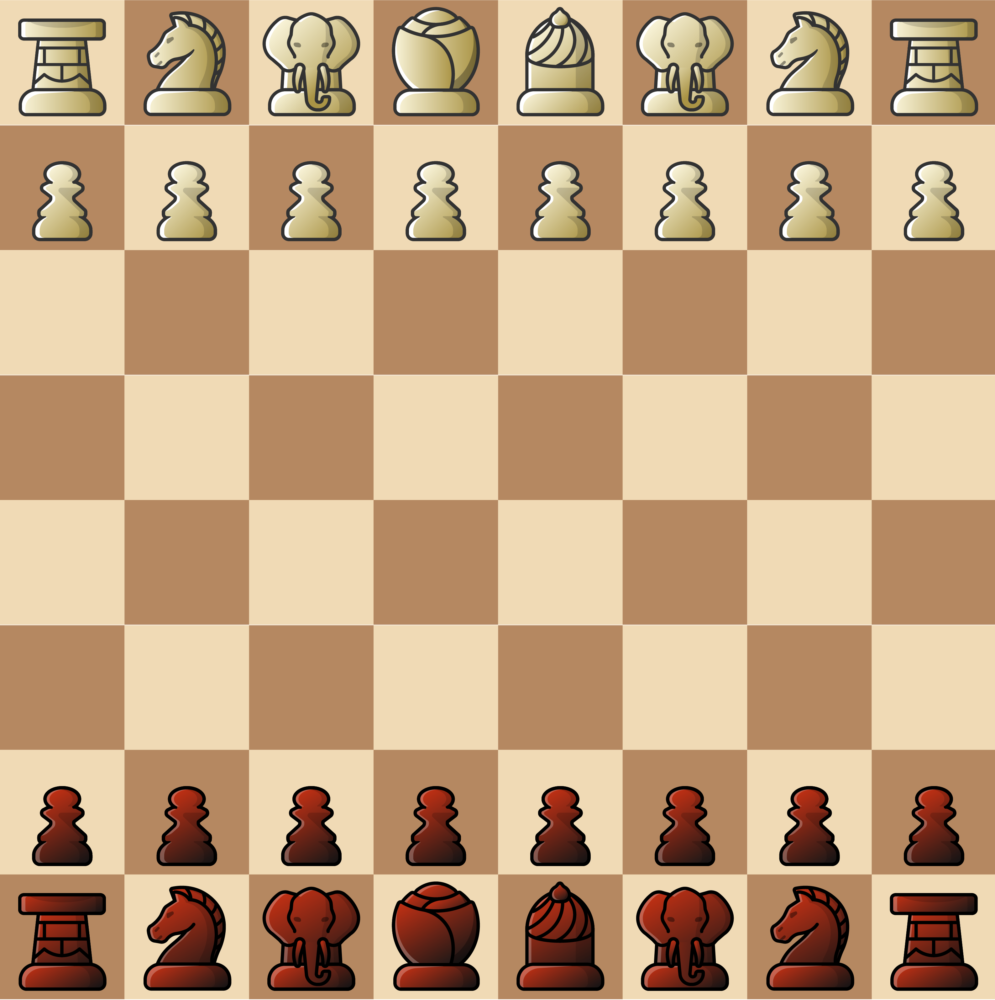
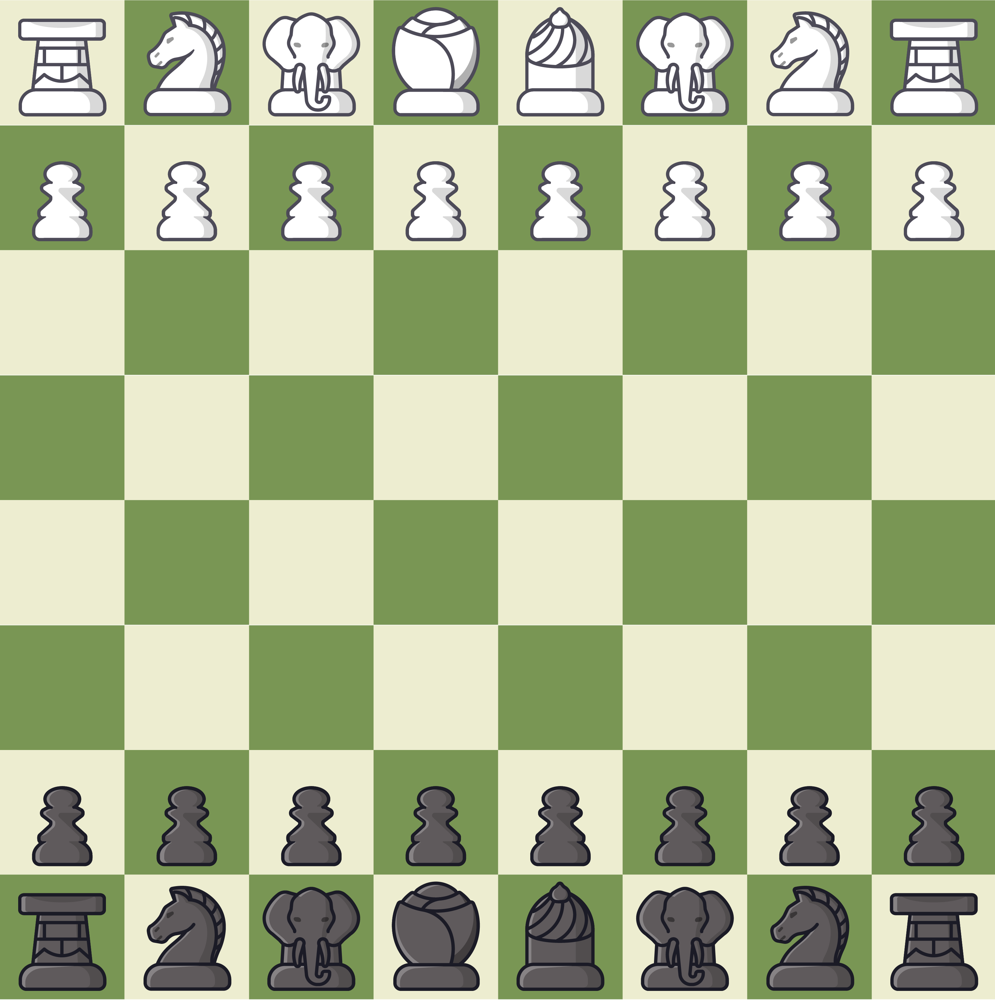
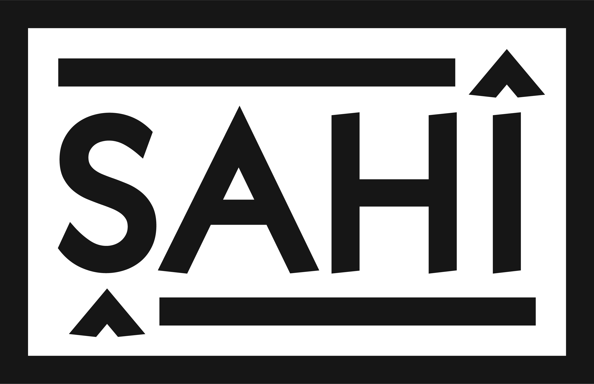
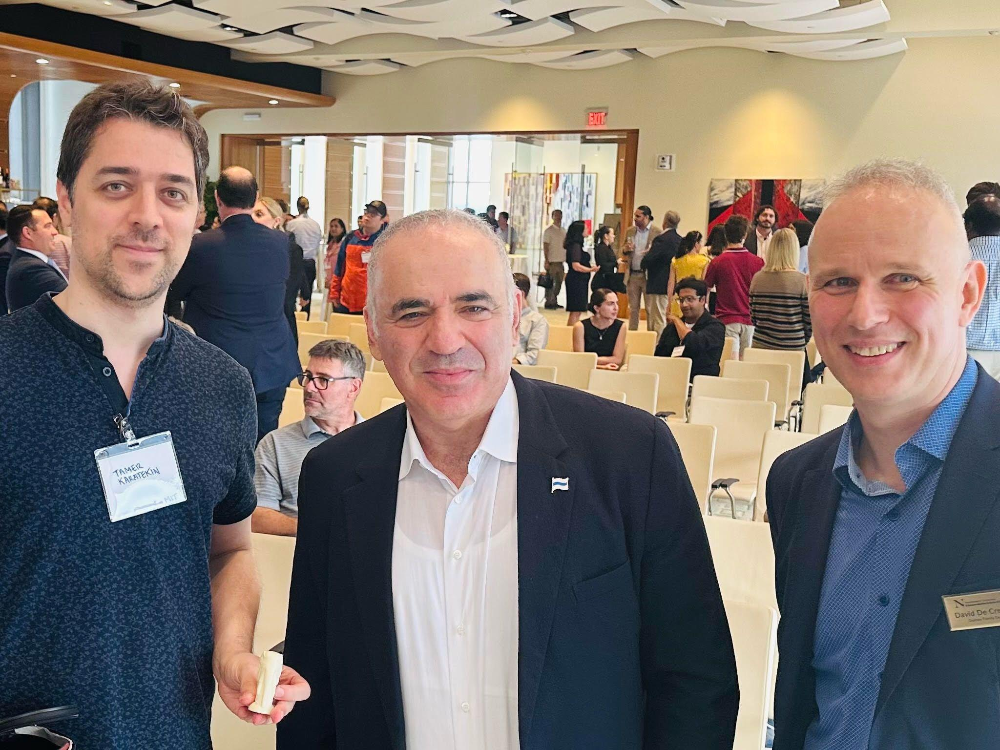

# Şahî (Shahi) Chess & Shatranj Font (chess piece icon set)
A culturally inclusive, educational, and cross-platform SVG icon set for chess, shatranj, and historic variants.
ŞAHÎ (SHAHI) chess/shatranj icons - available free for personal or commercial use with no-modification, no-derivatives, no-removal-of-branding license

## 🖼 Preview

<p align="center">
  
  
</p>

<p align="center">
  
</p>

The **Şahî (Shahi) Font** is a vector-based chess & shatranj piece set designed by FM, FT, FSI **Tamer Karatekin** (DeepSeaChess LLC).  
It combines modern clarity with historical authenticity and cultural neutrality, making it suitable for:

- educational materials, including books and videos
- school programs and STEAM curricula  
- chess & shatranj software  
- websites and game engines  
- Lichess-compatible variants  
- academic, cultural, and historical presentations
- online tournament broadcasting, social media posting

This repository contains the original, unmodified SVG and font files in two different color combinations, ivory-brown and white-gray.

---

## ✨ Design Philosophy

The Şahî (Shahi) Font is built on four core principles:

### 1. Cultural and Spiritual Inclusivity
The designs intentionally avoid sectarian or religious symbolism, presenting chess imagery in a universal, welcoming form. This supports multilingual, multicultural, and multi-faith educational environments and reflects the global heritage shared by chess players in Europe, Asia, Africa, and beyond.

### 2. Historical Authenticity
The artwork draws inspiration from a broad spectrum of historic chess traditions, including:
- early shatranj and Middle Eastern – Central Asian designs,
- medieval and Renaissance European chess sets,
- archaeological and museum-documented piece styles from multiple regions.

Each chess piece icon's design has several stories behind it. For example, the rook piece has been historically called 4 different names: chariot, tower, cannon, boat. The design of the Şahî (Shahi) rook physical piece and its corresponding icon have elements of the wheel from the chariot, bricks from the tower, barrel of a cannon, and the anchor of a boat. The vizier piece has a military helmet as the commander of the army, which can also be viewed as the tip of a pen of a statesman/advisor. The shah piece has the dome under the which the ruler lives and its wise headwrap, which looks like a rose with petals, symbolizing life and fragility of the shah (king) piece. The elephant piece is inspired by the Charlemagne-Abbas elephant, which also existed as the chess piece from one of the most iconic chess sets made in Italy/Europe. 

### 3. Modern Utility
The vector-based SVG format and clean outlines ensure compatibility with:
- online chess platforms and real-time game interfaces,
- websites and front-end frameworks,
- mobile and desktop applications,
- game engines and graphical toolkits,
- software that uses scalable icon systems.

The font is optimized for on-screen display, retaining shape clarity at any resolution.

### 4. Educational Purpose
The Şahî Font is used across the Shatranj.ai curriculum and STEAM programs that connect chess logic with mathematics, coding, and artificial intelligence. It supports teachers, researchers, and curriculum designers who require culturally neutral and historically informed visual material. The fonts come in 3 color combinations, the first two are in SVG format as ivory-brown and white-gray pairs. The 3rd option is the silhouette font, which exists as ttf and woff2 formats. The silhouette font can be also used within Chessbase products if the DiagTTOld.ttf font file is replaced in the system. 
```
---
## 📦 Repository Structure

shahi-ivory-brown/
    └── svg/
        ├── Elephant Black.svg
        ├── Elephant White.svg
        ├── Horse Black.svg
        ├── Horse White.svg
        ├── Pawn Black.svg
        ├── Pawn White.svg
        ├── Rook Black.svg
        ├── Rook White.svg
        ├── Shah Black.svg
        ├── Shah White.svg
        ├── shahi-icons-ivory-brown-pieces-beige-board.png
        ├── Vizier Black.svg
        └── Vizier White.svg
shahi-white-gray/
    └── svg/
        ├── Elephant Black.svg
        ├── Elephant White.svg
        ├── Horse Black.svg
        ├── Horse White.svg
        ├── Pawn Black.svg
        ├── Pawn White.svg
        ├── Rook Black.svg
        ├── Rook White.svg
        ├── Shah Black.svg
        ├── Shah White.svg
        ├── shahi-icons-white-gray-pieces-green-board.png
        ├── Vizier Black.svg
        └── Vizier White.svg
silhouette/
    ├── DiagTTOld.otf
    ├── DiagTTOld.ttf
    ├── Shahi-Silhouette-English-Regular.ttf
    ├── Shahi-Silhouette-English-Regular.woff2
    ├── Shahi-Silhouette-Turkish-Regular.ttf
    ├── Shahi-Silhouette-Turkish-Regular.woff2
    ├──chessbase-font-instructions.txt
LICENSE.txt
README.md
---
```
---
## 🔤 Culturally Unifying Naming & Terminology

The Şahî physical and icon set was designed for both modern chess and historic chess, which was played across the Middle East, Mediterranean, Africa, and Europe. The Şahî (Shahi) Font reflects modern chess and shatranj heritage and is designed with culturally inclusive, religiously neutral principles. Chess pieces have been called different names across languages and time, which you can read more in the table here: https://en.wikipedia.org/wiki/Chess_piece

As the designer of these icons, you should know that I was exposed to chess terminology in many different languages since a young age, and I learned that chess pieces had sometimes more than a single name in a region or language. I was born in Yugoslavia, currently Macedonia, and learned chess from my grandfather who was an educator, translator, and one of the first dictionary writers in the Balkans. So I grew up learning chess terminology in Turkish, Serbo-Croatian, and Albanian. For example, in the Balkans they used to call the elephant piece, fil in Turkish, lovac as the hunter in Serbo-Croatian, and both fili and oficieri in Albanian.  In Macedonian, the "knight" chess piece is called both "оњ" and "скокач", horse and jumper respectively. My grandfather taught me the "queen" to be both "vezir" and "kraliçe" in Balkan Turkish, correspoding to "vizier" and "queen" in English. I grew up in Istanbul oldtown and started to attend since age 8 the Istanbul Chess Association locale in Beyoglu, where many masters played from various backgrounds, chess players from Armenian, Greek, and Jewish communities of Istanbul attended. Their own chess piece terms differed from Turkish chess piece terminology, with some overlap in meaning. At that time, I wasn't so aware of this overlap and difference in terminology, but later in life, I started to appreciate this diversity more. Later, when I attended a German-Turkish highschool in Istanbul, I learned chess from German and English chessbooks. I got my first ELO and got a FM title during European Juniors U20 in Estonia, where they call the elephant chess piece "the spear". At Turkish national team, I was coached by World Seniors Chess Champion Evgeny Vasiukov, who knew little English and spoke mostly in Russian. So I was exposed to chess terminology in many languages as I grew up and became Turkish National Champion in 2000.

I should tell a story here, so I understand some of my motivation. Jiray Çakır, the Armenian-Turkish chess organizer from Istanbul, was the president of the Turkish Chess Federation was also a chess teacher at the Galatasaray French Lycee in Beyoglu. He was influential in inviting Kasparov to Istanbul to play a simul against Turkish young players in 1997. I was one of the players in this simul and was able to hold a draw against Kasparov. Many years after in 2024, I met Kasparov in Boston and gifted him the elephant piece of the Şahi chess set. Now, Kasparov was a very multicultural person himself. As you can see in his life story, he had an Armenian mother and a Jewish father and was born in Azerbaijan. He grew up in Moscow and considers himself culturally Russian. Now although in Armenian, Hebrew, Azerbaijani and Russian, the elephant piece is being called an elephant, Kasparov probably never played with an elephant chess piece, but rather only the bishop design with a mitre from the Staunton set. So I gifted him the Şahî physical set and held the elephant piece in my hand in our photo.  It felt that this piece could have been designed like an elephant with the new production techniques of the 20th century and be more consistent with the language we use for chess terms in most of the world.

<p align="center">
  
</p>
<p align="center">
  <em>
     Tamer Karatekin, Garry Kasparov, Prof. Cremer, and the Charlemagne–Abbas elephant piece from the Şahî chess set<br>
    Northeastern University, Boston, 14 June 2024.
  </em>
</p>

So you are welcome and encouraged to use multilingual terminology in your teachings of chess with the Şahî icons. I think chess offers a great way to pick language fluency, especially for young children.

Sometimes, I prefer to use one unified terminology for both chess and shatranj, because the rules of the games are very similar and chess evolved from shatranj, which evolved from chaturanga. Shatranj is the term used for chess across Mediterranean, for example Portuguese word Xadrez and Spanish Ajedrez come from Shatranj. For English-language educational use, my preferred terminology for the chess pieces is: shah, vizier, rook, elephant, horse, and pawn. These correspond respectively to the king, queen, rook, bishop, knight, and pawn. I feel the terms, "shah, vizier, rook, elephant, horse, and pawn" have less association with monarchies. I use the term "shah" in a more metaphorical/poetric way compared to the usage of "king", and also because shah is used as the name of the chess game in my languages, such as German (Schach). Also "shah" word has been used as a prefix and suffix in female names as well, such as Gülşah, meaning rose-shah or smile-shah. Similarly, the advisor and military leader status of the "vizier" word feels better to me compared to "queen" word, because the "queen" piece is the strongest / most mobile piece of the modern chess game. "Vizier" and "Ferz" have same/similar meaning in Persian. 

I should note here that in medieval Europe, the original name of the piece — the Persian–Arabic “firz” (or “ferz”), meaning advisor — was reinterpreted as the Old French word “vierge” (maiden), partly because of phonetic similarity. This association later shifted culturally to “dame” (lady), and from there the English term “queen” and Spanish term "reina" emerged. So the modern “queen” is a European reinterpretation of the original advisor/vizier piece rather than a direct linguistic descendant. Interestingly, the modern game of “dama” (checkers)—which emerged in medieval France—preserves the original movement of the vizier/ferz piece: a single diagonal step. Inspired by these histories, the helmet of the vizier icon in the Şahî set draws design cues from the headwears of Joan of Arc, Boudica, and Tomiris—three iconic female commanders. I should also note that Timur—the Central Asian commander and noted chess enthusiast, who ruled from Samarkand (formerly Afrasiyab), the region where the world’s earliest known chess set was found—is depicted in statues wearing a distinctive spiral helmet. This historical motif also influenced the design direction of the vizier icon. Another reason I like to call this piece vizier is that in the origin story of chess, when Indian envoys brought chess to Persia, it is narrated that it was Vizier Bozorgmehr who greeted them and later commissioned/wrote the first book on chess, known as Wizārišn ī čatrang (Book of Chess). I also did a chess-in-school presentation in Belarus with www.deepeseachess.com , where they call the "queen" piece, візыр (vizier).

I should add a few further details. The chess piece known in English as “bishop” is called “elephant” in the majority of the world’s languages, including Spanish, Russian, Armenian, Chinese, and Turkish. In old English, it was once called an archer. Likewise, the piece called “queen” in modern English chess is associated with an advisor, vizier, or statesman figure in many linguistic traditions including Belarussian, and is also understood as a military leader in languages such as Polish and Hungarian. The pawns of the Şahî set are inspired by the Regence café chess set and Age of Enlightenment, while the top of the queen piece is inspired by Austrian café-house chess sets and the Lasker-Schlechter 1911 World Championship set. The rook is inspired by South Slavic designs where this piece is called "top", meaning cannon. The horse design is inspired by the horse as Alexander the Great, Bukefal, which died in a battle against elephants, in the same region near Dalverzin Tepe where some of the earliest terracotta elephant pieces—perhaps earliest chess artifacts—have been discovered. Alexander the Great and his commanders had coins where elephant shapes and Bukefal horse head was printed on. The game of chess is called "elephant board game" in Chinese, bringing back the elephant in the icons also appeals to a large Asian audience. Similarly, the king piece in Chinese chess isn't called king or emperor, rather general or marshal, so I think my introduction of the military helmet on top of the vizier piece rather than a crown is also more inline with the Asian traditions of chess. When I explain chess to beginners or to people who want a fresh artistic look at the game, I describe the "king" piece as the spiritual leader of the army, and the "queen" piece as the military leader of the army. With these 2 abstract roles, there is room for exploration for the all the different multilingual terminology of chess.

In summary, platforms and educators are welcome and encouraged to use multilingual terminology where appropriate. This recommendation is offered to support cultural context and educational clarity and is not a mandatory naming requirement.

For more detail, see Section 12 of the license. Full license:  
See [LICENSE.txt](LICENSE.txt) for complete terms.


---

## 📥 Installation & Usage

### Use as SVG icons  
Copy any SVG from the folders directly into your project.

---

## 📜 License Summary  

The Şahî Font is **free for personal, educational, non-profit, and commercial use**, as long as the files remain **unmodified**.

Key points from the full license:

- **No modification** of the artwork (including vector files)  
- **No derivative fonts**  
- **No removal of branding or metadata**  
- **No AI training datasets**  
- **Redistribution allowed only unmodified**  
- **Physical Şahî Chess Set is a separate copyrighted work**  
- **Cultural terminology is recommended but not required**  

Full license:  
See [LICENSE.txt](LICENSE.txt) for complete terms.


---

## 🌐 Related Projects & Links

- **Şahî Master Set (Physical Chess Set that mathces the icons):**  
  https://www.shahimasterset.com  

- **Design Philosophy & Cultural Background (TEDx Talk):**  
  “Chess: Bridging Cultures, Inspiring AI, and Redefining Education”  
  https://www.youtube.com/watch?v=BDLiXo_acLg  

- **Chess and Shatranj AI Curriculum Project:**  
  https://www.shatranj.ai  

- **DeepSeaChess: Parent Company and Early Childhood Curriculum Website**  
  https://www.deepseachess.com/shahi  

---

## 🤝 Contributing

Because this is a protected artwork project, **modifications and pull requests altering the icons cannot be accepted**.  The design process took roughly 25 revisions and spanned multiple months with feedback from various artists, historians, and designers, so it is important to keep the artistic integrity of the project. If you want to help financing of or contributing to the designing new chess piece glyphs as an extension of the Şahî chess icons, please reach out.

However:

- bug reports,  
- documentation updates,  
- educational integrations, and  
- usage examples  

are always welcome.

---

## 💬 Contact

To share your comments or support our chess art and AI education projects:

**Tamer Karatekin**  
DeepSeaChess LLC  
www.deepseachess.com/shahi  
www.shahimasterset.com

www.linkedin.com/in/tamerkaratekin/


---
